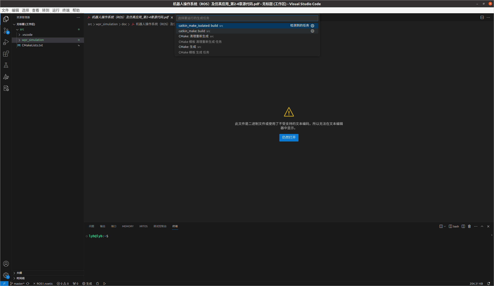
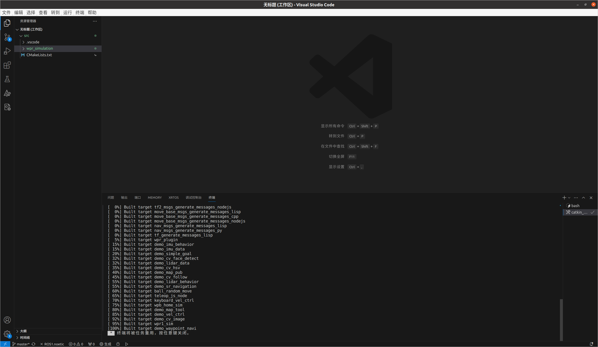
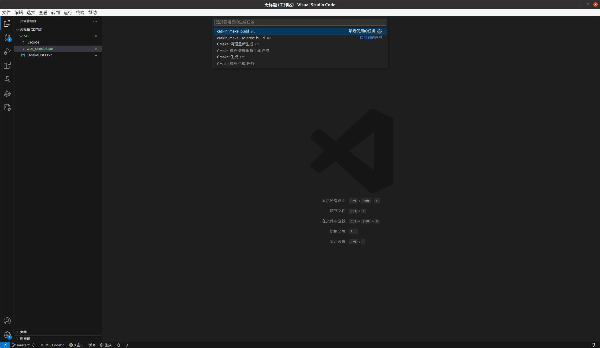
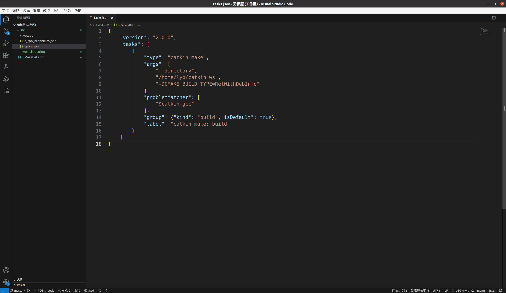
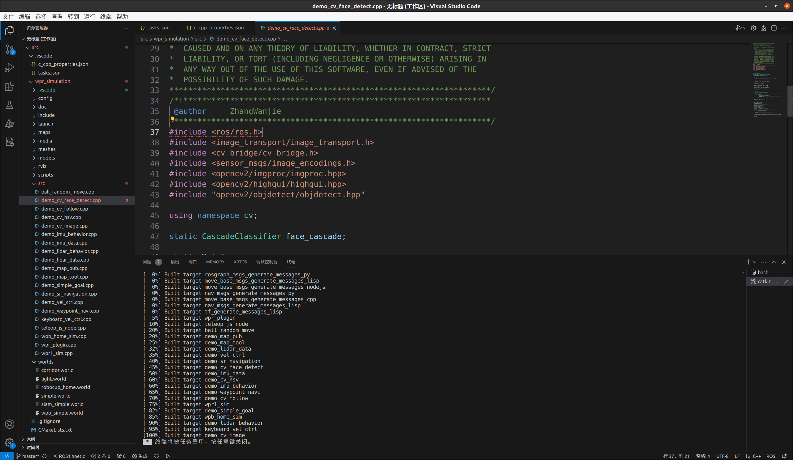
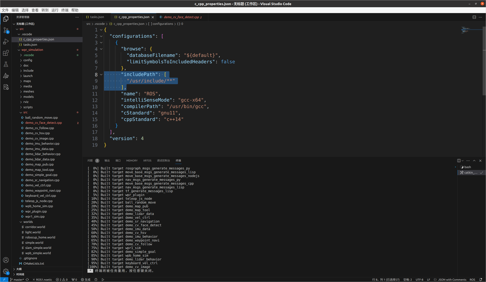
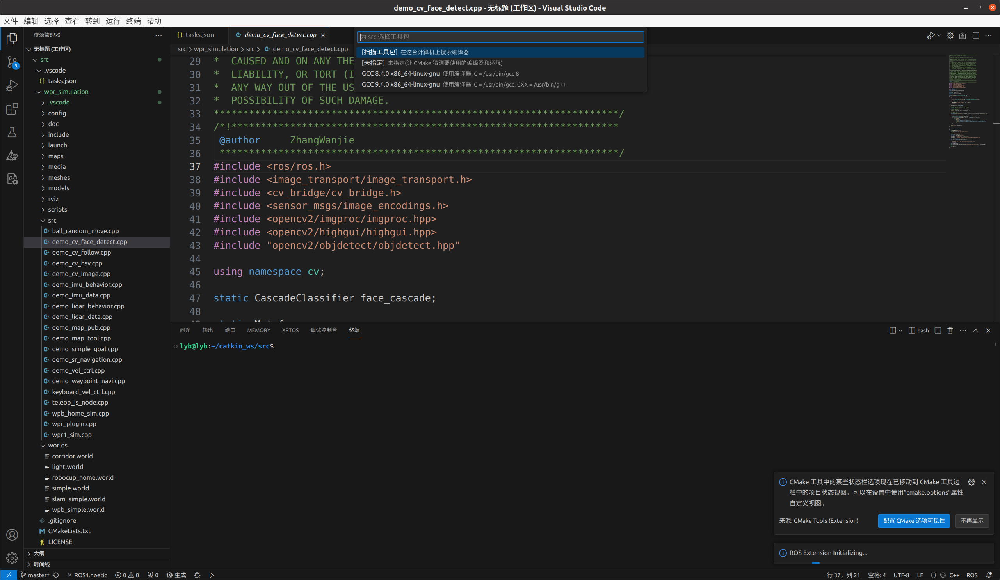
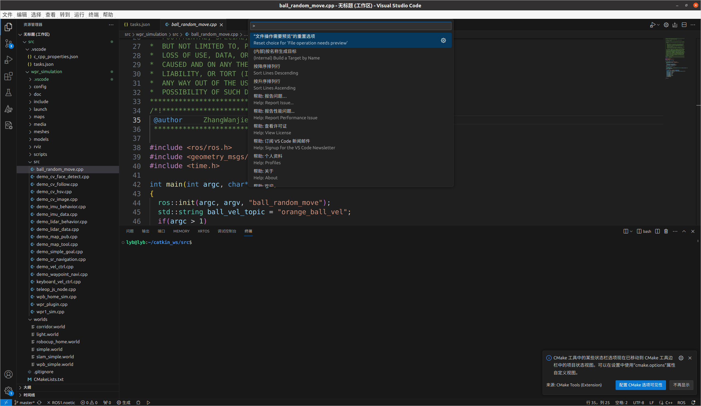
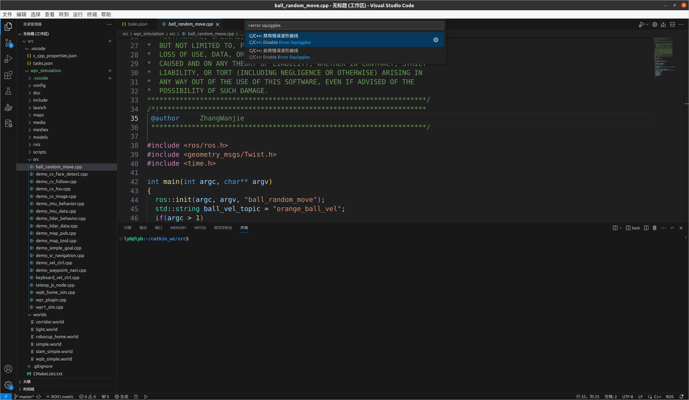
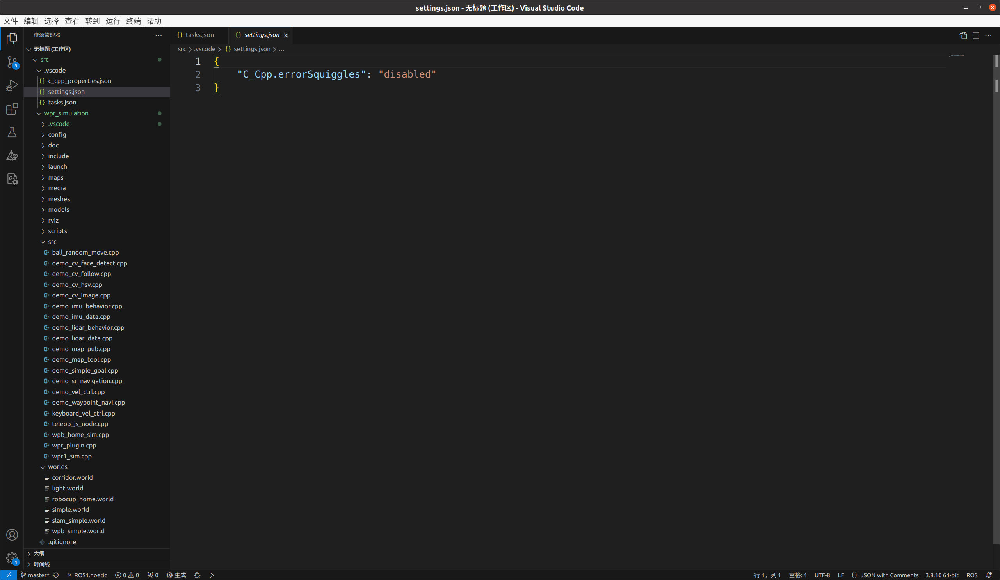

# Ubuntu VSCode的一些设置（ROS）

## 导入工作空间

- 推荐只导入工作空间下的src目录
  - 如果将整个工作空间导入VSCode，那么这个src就变成了次级目录，容易在写程序的时候把本应该添加到具体工程src目录里的代码文件给误添加到这个catkin_ws下这个src目录里

## Ctrl+Shift+B快捷编译设置

- 按住Ctrl+Shift+B 选择catkin_make:build



- 可以看到开始编译程序



- 接下来设置Ctrl+Shift+B为默认编译快捷键，按住Ctrl+Shift+B电机右侧的齿轮



- 将task.json中的内容修改如下

```json
{
	"version": "2.0.0",
	"tasks": [
		{
			"type": "catkin_make",
			"args": [
				"--directory",
				"/home/lyb/catkin_ws",
				"-DCMAKE_BUILD_TYPE=RelWithDebInfo"
			],
			"problemMatcher": [
				"$catkin-gcc"
			],
			"group": {"kind": "build","isDefault": true},
			"label": "catkin_make: build"
		}
	]
}
```



- 之后Ctrl+Shift+B就可以直接进行编译了

## 设置拼写错误检查

- 出现红色波浪线，主要是C/C++插件没有找到这些头文件的位置，所以认为这些文件都不存在



- 一个办法是打开左侧文件列表中的c_cpp_properties.json,在includePath中填入这些头文件所在的目录

  - 将c_cpp_properties.json删除，之后重新启动VSCode，可以在右下角看到ROS Extension Initializing（ROS扩展重新初始化），并且在初始化完成后c_cpp_properties.json重新出现了，这时ROS插件已经把includePath缺失的东西补齐了，之后报错就消失了（当然这一办法也不是万能的，有些头文件路径ROS插件也会遗漏）

  

- 还有一个办法就是直接关闭错误提示

  - Ctrl+Shift+P 弹出设置搜索栏

  

  - 输入error squiggles，选择C/C++：禁用错误波形曲线，即可关闭错误提示

  

  - 可以看到多了一个settings.json的文件，如果要启用错误提示，将disabled修改为enabled即可

  